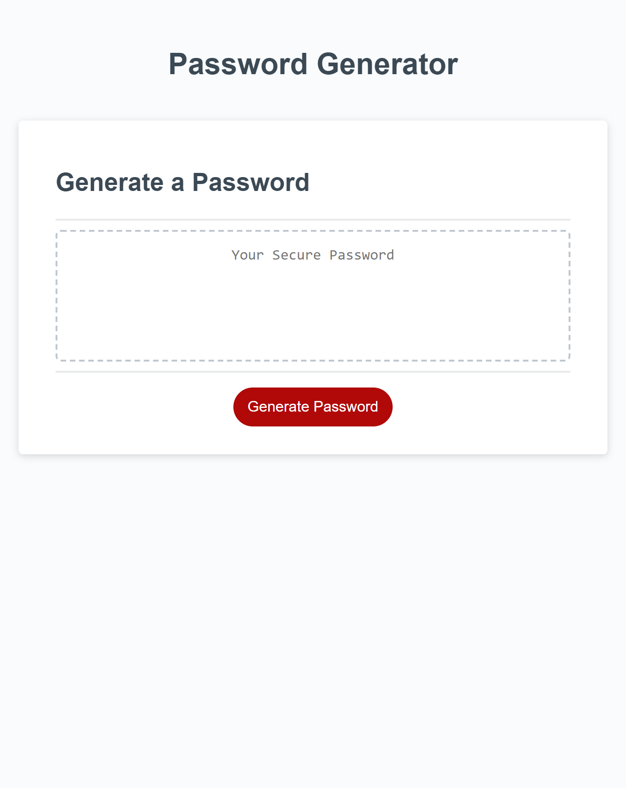

# Challenge 3

## Password Generator

This Password Generator was my first attempt at using javascript and it was fun and a challenge.  Not sure how anybody learned how to code before Stack Overflow, MDN Docs and Google.  The Password Generator here uses "prompt" and "confirm" to ask the user a series of questions about password length (8-128 characters), and whether the user wants lowercase letters, uppercase letters, numbers, and/or special characters.  And then upon clicking "Generate Password" will satisfy the criteria.  See corresponding js for comments, but if after selecting the number of characters, if the user does not select any of the types of characters, the URL will simply ask the questions over and over again.  

## Screenshot

## Links

https://github.com/GSuhir/Password-Generator

https://gsuhir.github.io/Password-Generator/

